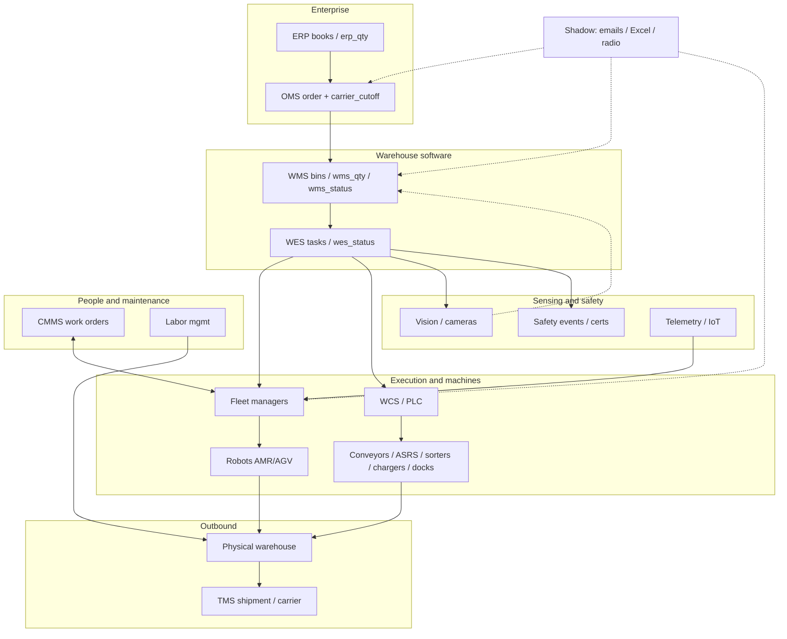
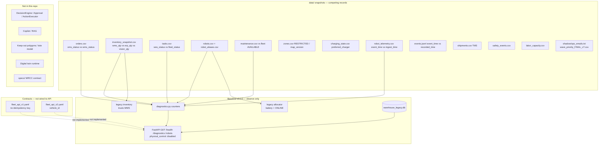
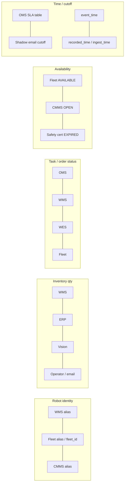
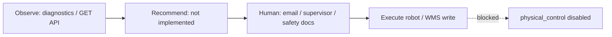

# P01-v1-CURRENT_ARCHITECTURE

**Prompt:** 01 — Warehouse Brownfield Forensics  
**Artifact:** Current-state architecture diagram (expanded from `docs/03_current_state_architecture.md`)  
**Baseline frozen:** 2.0.0 — `docs/03` was not edited  
**Rule:** Diagrams show only systems evidenced in this repo. Missing WRCC components are labeled absent, not invented.

Source sketch (unchanged):

```text
ERP → OMS → WMS → WES → Fleet Managers / WCS → Robots / PLCs / Conveyors / ASRS
                         ↘ Vision / Safety / IoT
CMMS ↔ Fleet                  ↓
Labor Mgmt                 Physical warehouse
TMS ← staging/ship confirmation

Shadow layer: CSV/Excel-like exports + emails + radio/manual overrides
```

`docs/03`: **No component has complete warehouse truth.**

---

## 1. Documented as-is flow (same boxes as docs/03)

Happy-path order movement plus side systems. Solid arrows = documented digital flow. Dashed = shadow / unofficial.



---

## 2. How this repo actually implements it (thin control plane)

There is **no live WarehouseState**, no DecisionEngine, and **no write path to robots**. State is snapshots.



Runnable surfaces: `python -m warehouse_control.cli diagnostics` and GET-only API. Fleet POST contracts exist as YAML only.

---

## 3. Competing systems of record (why no box is “the truth”)



Evidence already counted on baseline 2.0.0: 6 alias collisions, 7,382 inventory fights, 7,351 WES≠fleet, 176 CMMS vs AVAILABLE, 35 expired-cert still connected.

---

## 4. Authority boundary (current)



`docs/06` and `/health`: safety PLC, e-stop, speed-limit changes stay human. The LLM/copilot is **absent**, so it cannot currently sit on the write path — and must not be added onto `/diagnostics` as a substitute for this architecture.

---

## 5. How to use this with docs/03

| Artifact | Role |
|----------|------|
| `docs/03_current_state_architecture.md` | Frozen baseline sketch |
| This file | Evidence-backed expansion for P01 |
| `P01-v1-CURRENT_STATE.md` | File-level inventory |
| `P01-v1-SDD_GAP_ANALYSIS.md` | WRCC PASS/PARTIAL/FAIL tags |
