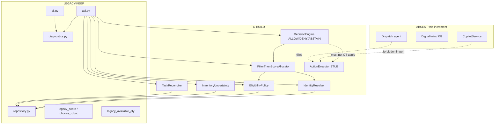

# 05 — Target C4 architecture (Repo 2 / Option A)

**FDE Operating Model phase:** 9–10 — Information + application architecture  
**Prompt:** `AI_Native_Warehouse_Robotics_PROMPT_LIBRARY_15_new.md` Prompt 09  
**Date:** 2026-09-17  
**Mode:** Architecture specs only. No `src/` changes. No live OT. No agents.

**Binding:** ADR-001 (Option A only), ADR-002 (LLM off write path), I1–I12, retain/drop contracts.

**Selected shape:** smallest architecture that can be implemented **on this codebase**. UC-2 Copilot is drawn as **ABSENT this increment** (optional later; ActionProposal only).

---

## File naming (why this is `05_` not `09_`)

The **prompt number** is 09. The **spec series** in `specs/` is already:

| File | Prompt |
|---|---|
| `specs/01_domain_model.md` | 05 |
| `specs/02_data_contracts.md` | 06 |
| `specs/03_evaluation_strategy.md` | 07 |
| `specs/04_options_and_tradeoff.md` | 08 |
| **`specs/05_target_c4.md`** (this) | **09** |
| `specs/05_api_contracts.md` | 09 |
| `specs/05_failure_modes.md` | 09 |
| `specs/06_hard_gates_and_authority.md` | 10 |

The library names these artifacts `05_*`, not `09_*`. Using `09_` would break the spec series.

---

## Inputs from Prompts 02–08

| Input | How used |
|---|---|
| 02 current-state C4 | As-is containers kept; missing pieces relabeled TO-BUILD vs still ABSENT |
| 02 SoR matrix | Identity, inventory, task, cutoff claimants stay competing |
| 04 GO / T0–T5 | Observe + refuse/abstain; Execute OT remains disabled |
| 05 domain I1–I12 | Component responsibilities |
| 06 retain/drop | No CSV cleaning; adapters at API boundary only |
| 07 EVAL-001–022 | Each TO-BUILD component has a `must_not` |
| ADR-001/002 | A only; DecisionEngine abstains; executor not importable from copilot |

**As-is (Repo 1) remains true until Prompt 12 code exists.** This file is the **to-be** for Option A.

---

## Status legend (use on every box)

| Tag | Meaning |
|---|---|
| **LEGACY-KEEP** | Exists in Repo 1. Keep callable. Do not delete for “cleanup.” |
| **TO-BUILD** | Option A increment (Prompts 12–13). Not in `src/` today. |
| **ABSENT** | Not in first increment. Do not draw as live. |
| **STUB** | Module exists so import boundaries can be tested; always refuses OT. |

---

## A. Context (to-be)

Still a **synthetic local warehouse**. No new external systems. No Azure. No live fleet/WMS/PLC.

```text
[Carriers A–D]                 [Robotics / vision / conveyor vendors]
        |                                   |
        |  extracts already in data/        |  extracts already in data/
        v                                   v
[Fictional warehouse estate — 18 DCs, floor people, robots, PLCs]
        ^
        |  synthetic files only; still no OT link
[FDE participant / analyst]
        |
        v
[Repo 2 warehouse_control — Option A]
   Observe CSV/SQLite
   Reason: identity, eligibility, inventory uncertainty, task reconcile
   Propose: ActionProposal (deterministic)
   Decide: ALLOW / DENY / ABSTAIN
   Execute OT: STUB, always disabled
        |
        x  ABSENT this increment: Copilot/RAG, digital twin,
           live WMS, live fleet POST, safety PLC write, agent tools
        x  ABSENT forever in this engagement: Option C dispatcher
```

**Context rule:** Repo 2 does not become a fleet vendor. `contracts/fleet_api_v1.yaml` and `v2.yaml` stay **evidence of drift**, not clients to call.

---

## B. Container (to-be)

```text
                         LEGACY-KEEP + additive routes
                    +----------------------------------+
                    |  FastAPI warehouse_control       |
                    |  GET /health                     |
                    |    physical_control=disabled     |
                    |  GET /diagnostics  (extended)    |
                    |  GET /robots/{id}  (legacy row)  |
                    |  + identity / eligibility /      |
                    |    inventory / reconcile /       |
                    |    preview-allocate / preview-   |
                    |    decide   [TO-BUILD]           |
                    +----------------+-----------------+
                                     |
          +--------------------------+--------------------------+
          |                                                     |
          v                                                     v
+---------------------------+                      +---------------------------+
| CSV / JSONL / TXT         |                      | SQLite                     |
| data/raw, telemetry,      |  LEGACY-KEEP         | warehouse_legacy.db        |
| shadow, reference         |  RETAIN conflicts    | 8 tables (incomplete vs    |
|                           |                      | CSV — do not prefer DB)    |
+---------------------------+                      +---------------------------+
          ^
          |
+---------------------------+     +----------------------------------+
| CLI                       |     | pytest + evals jsonl             |
| diagnostics + new explain |     | LEGACY-KEEP seed; Repo 2 pack    |
| LEGACY-KEEP + TO-BUILD    |     | harness ABSENT until Prompt 14   |
+---------------------------+     +----------------------------------+

ABSENT write path to robots / WMS / PLC  (I10)
ABSENT Copilot container this increment  (ADR-001 B off)
ABSENT KG / digital-twin container       (ADR-001 D not required)
```

**Non-running contract files (LEGACY-KEEP as files, ABSENT as clients):**

| File | Status |
|---|---|
| `contracts/fleet_api_v1.yaml` (`robotId`, no idempotency) | LEGACY-KEEP evidence; **do not POST** |
| `contracts/fleet_api_v2.yaml` (`vehicle_id`, `/missions`) | LEGACY-KEEP evidence; **do not POST** |
| `contracts/order_event_schema.json` v1 `orderId` vs v2 `order_id` | LEGACY-KEEP; adapters may map names at the API edge |

---

## C. Component (inside the app)

### C.1 Map: Repo 1 today vs Option A

| Component | Path (current or planned) | Status | Owns | Must not |
|---|---|---|---|---|
| FastAPI | `api.py` | LEGACY-KEEP + additive GET/preview | HTTP observe | Enable `physical_control`; call fleet POST |
| CLI | `cli.py` | LEGACY-KEEP + explain commands | Local observe | Write CSV |
| Diagnostics | `diagnostics.py` | LEGACY-KEEP keys + extend | Conflict counts | Invent a single “truth qty” |
| Repository | `repository.py` | LEGACY-KEEP | CSV DictReader + sqlite | Prefer DB over CSV for missing tables |
| `RobotState` | `core/models.py` | LEGACY-KEEP as **legacy type** | Thin dataclass with `available` | Use `available` on UC-1 path |
| Domain types | `core/` (new) | TO-BUILD | Eligibility, Conflict, Uncertainty, Decision | Collapse SoR fields |
| Legacy allocator | `legacy/allocator.py` `legacy_score` / `choose_robot` | **LEGACY-KEEP named** | Before/after baseline | Be the operational chooser after Prompt 13 |
| Legacy inventory | `legacy/inventory.py` `legacy_available_qty` | **LEGACY-KEEP named** | WMS-trust baseline | Be pickable truth on UC-1 path |
| **IdentityResolver** | planned `identity/resolver.py` | TO-BUILD | Aliases; `IDENTITY_COLLISION`; unmatched `AMR-044` | Silent merge; coerce AMR-044 → RBT-0044 |
| **EligibilityPolicy** | planned `eligibility/policy.py` | TO-BUILD | Cert, CMMS, payload, connectivity, calibration, zone | Treat fleet AVAILABLE as eligible |
| **InventoryUncertainty** | planned `inventory/uncertainty.py` | TO-BUILD | Retain wms/erp/vision; UNCERTAIN when disagree | Emit one qty as truth; trust system name |
| **TaskReconciler** | planned `tasks/reconcile.py` | TO-BUILD | WES vs fleet; refuse COMPLETE on split | Close `ORD-000968` while PACK_FEED EXECUTING |
| **CutoffAwareness** | planned `fulfillment/cutoff.py` | TO-BUILD | `carrier_cutoff` + TMS DELAYED + shadow as Conflict | Treat OMS SLA table as live (I7) |
| **FilterThenScoreAllocator** | planned `allocator/filter_score.py` | TO-BUILD | Filter by Eligibility, then score remainder | Score INELIGIBLE robots; drop `legacy_score` function |
| **DecisionEngine** | planned `decision/engine.py` | TO-BUILD | ALLOW / DENY / **ABSTAIN** | Call LLM; call OT execute; auto-approve T4 |
| **ActionExecutor** | planned `execution/executor.py` | TO-BUILD **STUB** | Always `{applied: false, physical_control: disabled}` | Be importable from copilot; POST missions |
| CopilotService | — | **ABSENT** this increment | If later: ActionProposal text only | Import ActionExecutor; set Eligibility |
| Digital twin / KG | — | **ABSENT** | — | Repo 2 gate |
| Agent tool host | — | **ABSENT** (C killed) | — | Dispatch robots |

### C.2 Must-include Option A loop

```text
CSV/SQLite (LEGACY-KEEP)
        |
        v
 IdentityResolver ──Conflict IDENTITY_COLLISION──┐
        |                                        |
        v                                        |
 EligibilityPolicy (I1,I2,I5,I6,I12, connectivity)┤
        |                                        |
        v                                        |
 InventoryUncertainty (I3 retain triple)         ┤
        |                                        |
        v                                        |
 TaskReconciler (I4) + CutoffAwareness (I7)      ┤
        |                                        |
        v                                        v
 FilterThenScoreAllocator  →  ActionProposal  ←── Conflicts + Uncertainty
        |                         |
        v                         v
 DecisionEngine                   Diagnostics (extended counts)
  ALLOW | DENY | ABSTAIN
        |
        x  does not call ActionExecutor OT
        |
        v
 ActionExecutor STUB → always disabled (I10)

 Copilot (ABSENT now) ─x─► ActionExecutor   forbidden import (ADR-002)
```

**ABSTAIN is a first-class Decision**, not an error. Required when evidence is UNKNOWN (inventory disagree, WES≠fleet terminal conflict, unmatched identity, unknown occupancy, unknown mission ack). See `specs/05_failure_modes.md`.

### C.3 Import / package boundary (ADR-002)

Enforced by `tests/test_untrusted_content.py` (Prompt 11). Copilot ABSENT is compliant.

| Importer | May import | Must not import |
|---|---|---|
| `decision.engine` | identity, eligibility, inventory, tasks, allocator, repository | LLM client; `execution.executor` OT apply |
| `allocator.filter_score` | eligibility, identity | `legacy.allocator.choose_robot` as the chosen path; copilot |
| `execution.executor` | Decision type only | copilot; LLM |
| Future `copilot` | read-only evidence DTOs / ActionProposal builder | **`execution.executor`**, `choose_robot`, repository writes, Eligibility mutators |
| `legacy.*` | nothing new | Must remain importable for before/after |

If Copilot is added later, a test **fails** if `copilot` can import `ActionExecutor`.

### C.4 Mermaid — component (Option A)



---

## D. What each TO-BUILD component does (smallest)

### IdentityResolver

- Input: `robot_id` or an `alias` string from WMS/FLEET/CMMS.
- Output: registry `robot_id` **plus** all alias rows **plus** Conflict if the same alias maps to more than one robot (`BOT-COLLISION-*`).
- Unmatched floor names (`AMR-044` in email/cascade): Uncertainty; **do not** bind to `RBT-0044`.
- `/robots/{id}` legacy GET stays a SQLite row. Collision disclosure is a **new** identity endpoint (see `05_api_contracts.md`) so the brownfield GET is not silently “fixed.”

### EligibilityPolicy

Deterministic `ELIGIBLE | INELIGIBLE | ABSTAIN` for (robot, task):

| Gate | INELIGIBLE when |
|---|---|
| Safety | `safety_cert_status=EXPIRED` (I1) |
| Calibration | `calibration_status=OVERDUE` (I2) |
| CMMS | open/in-progress WO without recorded SafetyOfficer release (I5). Shadow “supervisor approved tonight” is **not** a grant |
| Connectivity | `OFFLINE`. `INTERMITTENT` → Uncertainty; may ABSTAIN |
| Payload | known task payload > `payload_kg` (I12). Task payload ABSENT → ABSTAIN, do not assume fit |
| Zone | `robot_access=RESTRICTED` or occupancy UNKNOWN (I6) |
| Site | `SITE_MISMATCH` is Conflict; do not treat as “robot moved.” May ABSTAIN for assign across DCs until Prompt 10 says otherwise |

Fleet `health_status` / `AVAILABLE` is **not** a pass. That is the Repo 1 false-available defect.

### InventoryUncertainty

- Always return `wms_qty`, `erp_qty`, `vision_qty`, `reserved_qty`.
- If the three qty fields are not equal → `uncertain=true` (I3). **No** `available_qty` on this path.
- `legacy_available_qty` remains a named baseline only.
- Vision confidence collapse (CAM-18 / inject_04/05): vision is observation, not identity or pickable truth.

### TaskReconciler

- Compare `wes_status` vs `fleet_status` on the same `task_id`.
- Split → Conflict `TASK_STATUS`. Must **not** mark Task or parent Order COMPLETE (I4). Fixture: `TSK-000968-1` / `ORD-000968`.
- After outage: reconcile per task; do not replay all fleet rows (I11). Unknown ack → ABSTAIN.

### FilterThenScoreAllocator

1. Resolve identity (collisions stay visible).
2. Filter: only `ELIGIBLE`.
3. Score remaining (battery, connectivity among eligible; congestion/zone when data exists).
4. If zero eligible → no robot; Decision ABSTAIN or DENY with evidence list.
5. Keep `legacy_score()` in `legacy/allocator.py` for before/after.

### DecisionEngine

```text
decide(ActionProposal) -> Decision
  ALLOW  — Policy satisfied; still no OT write
  DENY   — hard gate failed (expired cert, open CMMS, RESTRICTED zone, …)
  ABSTAIN — evidence UNKNOWN or competing terminal state
```

Does **not** call an LLM. Does **not** apply OT. Cutoff pressure does not override safety (I6).

### ActionExecutor (STUB)

- `execute(decision)` returns applied=false, `physical_control=disabled`, reason=`I10`.
- Exists so Copilot-import tests have a real module to forbid.
- No HTTP route that forwards to fleet v1 `/robots/{robotId}/task` or v2 `/missions`.

---

## E. Diagnostics extensions (additive)

Keep existing keys from `diagnostics.py` (robots, alias_collisions, inventory_truth_conflicts, wes_fleet_task_conflicts, maintenance_availability_conflicts, expired_safety_cert_but_connected, duplicate_telemetry_packets).

**TO-BUILD keys** (compute, do not clean source data):

| Key | Meaning |
|---|---|
| `identity_collisions_detail_count` | Same as collisions; later list sample ids |
| `eligibility_ineligible_expired_cert` | Count I1 |
| `eligibility_ineligible_open_cmms` | Count I5 |
| `inventory_uncertain_rows` | Same grain as inventory_truth_conflicts |
| `orders_oms_wms_status_conflicts` | 02/03: 1,283 |
| `cutoff_delayed_shipments` | DELAYED count |
| `abstain_preview_supported` | literal true once DecisionEngine exists |

Do not replace the old keys. Before/after needs both.

---

## F. Explicit non-goals for this C4

- No agent tool APIs, no multi-agent orchestration.
- No mandatory KG/twin.
- No Copilot in the first increment (ADR-001).
- No enabling physical control.
- No new synthetic warehouse data.
- No rewrite of `legacy_score` in place — **replace operational use** later, keep the function.
- Hard-gate catalog G1–G8 is Prompt 10; this C4 only requires the engine to **be able to abstain** and the stub executor.

---

## G. What Prompt 09 does *not* do

- No changes under `src/`
- No pytest yet (Prompt 10 may add xfail specs; Prompt 12 implements)
- No eval harness (Prompt 14)

**Companions:** `specs/05_api_contracts.md`, `specs/05_failure_modes.md`  
**Next:** Prompt 10 — hard gates G1–G8 and autonomy tiers.
