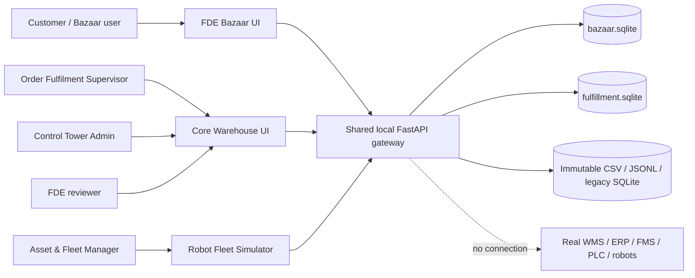
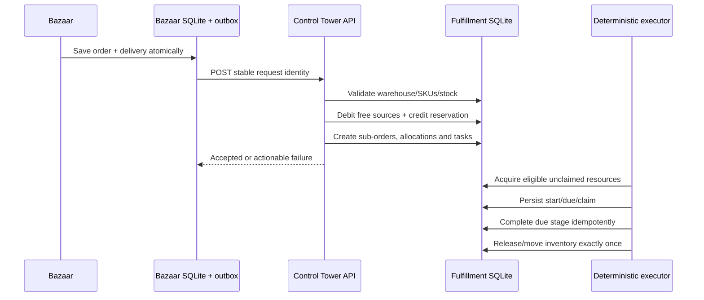

# Repo 3 as-built architecture

## 1. Context

The package is a local modular monolith. `local_server.py` binds to
`127.0.0.1`, mounts three prebuilt SPAs and serves one Python API process.

## 2. Containers

| Container | Technology | Responsibility | State |
|---|---|---|---|
| Core Warehouse | React/Vite/TypeScript | Fulfillment, personas, resources, review, admin | Browser |
| FDE Bazaar | React/Vite/TypeScript | Customer order entry, delivery and receipt/history | Browser |
| Robot Fleet Simulator | React/Vite/TypeScript | Assignment, failure, replacement, recovery, charging | Browser |
| Shared API | Python 3.11, FastAPI, Pydantic | Routes, validation, policies, scheduler and adapters | Process |
| Fulfillment store | SQLite | Orders, sub-orders, allocations, tasks, movements, resources, interventions, forecasts | Durable local |
| Bazaar store | SQLite | Order request, delivery state and durable outbox | Durable local |
| Brownfield evidence | CSV, JSONL, legacy SQLite | Immutable inherited evidence and review data | Read-only |
| Generated clients | OpenAPI, Orval, Zod | Selected typed browser/API contracts | Build artifact |

## 3. API components

| Component | Key module | Responsibility |
|---|---|---|
| Gateway/bootstrap | `baseline_demo.py` | Mount routers, lifecycle hooks and inherited app |
| Fulfillment facade | `fulfillment_api.py` | Catalog, resources, orders, config, forecasts, executor |
| Policy v2 | `fulfillment_v2.py` | Per-SKU allocation and current scheduler |
| Intake | `bazaar_api.py` | Bazaar orders, delivery outbox and retries |
| Persona control | `persona_api.py` | Workspaces, interventions, repair, policy and audit |
| Fleet readiness | `fleet_readiness.py`, `fleet_repair.py` | Readiness evidence and atomic repairs |
| Lifecycle | `robot_lifecycle.py`, `lifecycle_api.py` | Claims, battery, charging, failure, kill, replacement, recovery |
| Progress projection | `order_progress.py` | Durable fulfillment vocabulary and order export |
| Forecasting | `demand_forecast.py` | Saved statistical demand baseline and explanations |
| Replay | `replay_api.py`, `replay_runner.py`, `replay_merge.py` | Offline copied-state simulation and evidence |
| Legacy review | `review_api.py`, nested brownfield repo | Diagnostics, source records and pure allocator inspection |

## 4. Main runtime flow

## 5. Consistency boundaries

1. Bazaar saves intake and outbox state before handoff.
2. Core acceptance, source debit, reservation, allocations and queue records are
   one transaction.
3. Fleet acquisition is separate; lack of a resource does not erase an accepted
   reservation.
4. Quantity movements use persistent identities to prevent duplicate effects.
5. Task clocks and claims are persisted and reconciled after restart.
6. Corrections use revisions/tokens and preserve protected accounting.
7. Raw source files are never the mutable operational store.

## 6. Data architecture

### Immutable evidence plane

- 19 source datasets covering warehouses, SKUs, robots, inventory, tasks,
  maintenance, zones, telemetry, safety, events, assets, labor, orders and
  shipments.
- Original legacy SQLite and nested V2 source.
- Used for review, initial evidence and effective-source calculation.

### Mutable simulation plane

- `fulfillment.sqlite`: current simulated inventory, reservations, tasks,
  movements, scenario overlays, registrations, interventions, audit, lifecycle,
  forecasts and generated progress.
- `bazaar.sqlite`: customer requests, delivery state and retry/outbox metadata.
- App corrections update this plane only; they do not update external systems.

### Evidence/replay plane

- Backups, live snapshots, simulation copies, manifests and CSV reports.
- The supplied ZIP omits 45 backup/replay files listed in the package manifest.

## 7. Security and authority boundary

Repo 3 relies primarily on loopback binding and trusted local use.

- `X-Demo-Persona` scopes selected actions but is caller-controlled.
- Bazaar, order and some scenario APIs are unauthenticated.
- `/api/fulfillment/assign-tasks` has no persona parameter in the inspected route.
- There is no production identity, session, CSRF, tenant or network authorization.
- The application performs simulated writes only; it has no external OT adapter.

This boundary is acceptable for an isolated local demo and unacceptable for
shared network, customer or physical-control use.

## 8. Deployment

The Windows package contains prebuilt frontends and starts the Python gateway
with `Start-Local.ps1`/`local_server.py`. The launcher supplies local database
paths and a loopback Control Tower URL.

No evidence shows:

- multi-instance coordination;
- managed database migration or high availability;
- TLS/reverse proxy configuration;
- centralized secrets, logs, traces or metrics;
- production backup/restore drills;
- customer environment deployment.

## 9. Architecture quality summary

| Quality | Assessment |
|---|---|
| Determinism | Strong; policy and scheduler are explicit |
| Auditability | Strong for local simulated state |
| Data preservation | Strong; inherited sources stay immutable |
| Transaction integrity | Strong design, test report available |
| Modularity | Moderate; clear modules, but `fulfillment_api.py` is large |
| API completeness | Partial; OpenAPI covers selected routes, not all runtime APIs |
| Security | Local-demo only |
| Scalability | Not proven; single-process SQLite design |
| Safety | Simulation boundary is explicit; physical safety not assessed |
| AI dependence | None |
