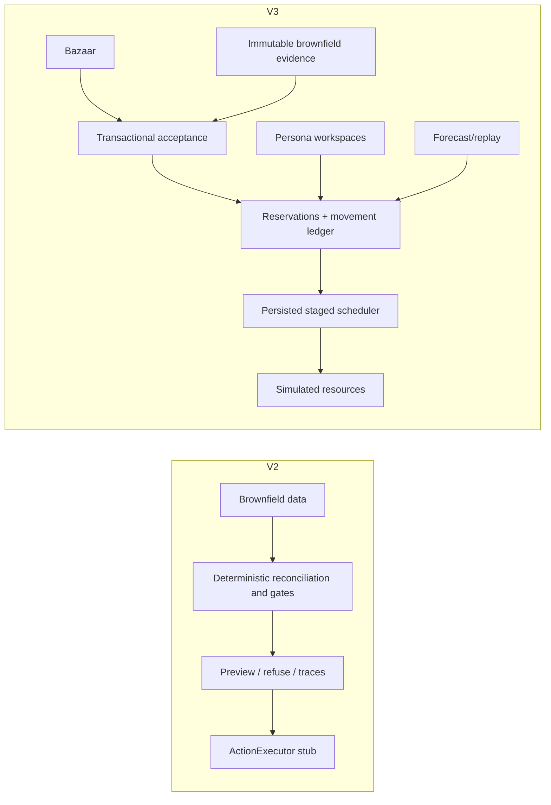

# V2 versus V3

## Executive comparison

V2 is a compact deterministic **observe/refuse/allocate proof** built directly
around the inherited brownfield data and FDE invariants. V3 embeds that
brownfield package inside a broader **local fulfillment product simulation**
with durable customer intake, inventory accounting, staged work, personas,
recovery, forecasting and multiple user interfaces.

V3 advances product breadth and simulated operations. It does not advance the
system to live OT, secure production or completed OM 17–21.

| Dimension | V2 | V3 |
|---|---|---|
| Primary purpose | FDE proof of deterministic gates | End-to-end local fulfillment simulator |
| User experience | Observe-only dashboard/API/CLI | Core, Bazaar and Fleet web apps |
| Customer order intake | Absent | Durable Bazaar intake/outbox |
| Operational state | Mostly source snapshot and proof outputs | Separate persistent SQLite simulation state |
| Inventory model | Uncertainty/conflict and refusal | Free/reserved/picked ledger with corrections |
| Task execution | Executor stub; no side effects | Simulated staged executor with persisted clocks |
| Resource lifecycle | Eligibility and injects | Claims, failure, replacement, recovery, battery/charging |
| Personas | Authority model in specs | Supervisor/Fleet/Admin demo workspaces |
| Interventions | Evidence/refusal | Persistent propose/approve/verify and direct repair flows |
| Forecasting | Not required | Transparent statistical 7/30-day baseline |
| Replay | Inject/eval traces | Copied-database replay and merge tooling |
| AI/LLM | Explicitly off write path; no runtime | No AI/LLM runtime |
| Physical control | Disabled | Still absent; all execution simulated |
| Auth/RBAC | Not a deployed application concern | Demo role header only; production blocker |
| Test evidence | 46 passed, 3 expected failures reported | 73 regressions plus package-focused tests reported |
| Packaging | Python repo/proof | Prebuilt local Windows package |
| OM 17–21 | Explicitly deferred | Still partial/not proven |

## Architecture evolution

## Requirement movement

| V2 residual/gap | V3 response | Remaining gap |
|---|---|---|
| No Approval store | Persistent intervention lifecycle exists | Demo identity is not secure approval authority |
| Command IDs absent | Request IDs, assignment tokens and movement IDs | No real controller command/result contract |
| Live execution absent | Local simulated executor | Physical execution intentionally absent |
| UC-2 copilot absent | Still absent; deterministic product expanded instead | None unless a justified future use case appears |
| Inventory physical reconcile open | App-owned corrections and accounting | Physical truth and external writes remain absent |
| Live monitoring absent | Persisted progress/lifecycle/replay | Production SLO, telemetry and on-call absent |
| Customer UI absent | Three dedicated SPAs | Production accessibility/security not assessed |
| Repo 3 future roadmap | Many local product themes implemented | Customer OM 17–21 still not completed |

## Safety continuity

The critical V2 boundary remains valid:

- deterministic policy is the decision authority;
- no LLM or agent controls assignment;
- inherited evidence is not silently cleaned;
- contradictions and missing evidence can block work;
- no live OT command is issued.

V3 introduces simulated mutating paths. The correct statement is therefore:

> V3 has operational writes to its own local SQLite simulation, but no write
> path to external warehouse systems or physical robots.

## Material policy forks

Repo3 is not merely V2 with more screens. The following changes must be called
out in any presentation or assessment:

| Topic | V2 policy | V3 policy | Interpretation |
|---|---|---|---|
| Inventory disagreement | Retain WMS/ERP/vision triple as `UNCERTAIN`; do not select physical truth | Allocation uses the conservative minimum; Supervisor mismatch closure can synchronize app-owned free quantities to the current maximum | V3 introduces an explicit modeled correction policy. It does not prove physical truth or update external systems. |
| Execution | `ActionExecutor` refuses application; preview/observe/refuse only | Persisted scheduler assigns and completes simulated tasks in SQLite | V3 proves simulator behavior, not safe OT execution. |
| Order scope | UC-1 proof around allocation/cutoff evidence | New Bazaar order is all-or-nothing in its selected warehouse; compatibility callers may progress available SKU siblings | This is new product policy, not a result inherited from V2 evals. |
| Resource lifecycle | Eligibility gates and disruption injects | Persistent claims, failure, kill/replacement, battery and charging simulation | Simulation data must not be presented as live fleet telemetry. |
| Authority | T0–T5 and hard-gate specification; approval store absent | Persona/intervention records exist, but identity is caller-controlled | Workflow persistence does not close the authentication/RBAC gap. |
| Assurance | Named G1–G8 and EVAL-001–022 | Repo3 has its own regression suite | Repo3 does not automatically inherit a passing result for every V2 gate/eval on its new executor. |

The copy of the brownfield repository inside the Repo3 ZIP is a trimmed,
read-only baseline used by the legacy review surface. It is not the complete V2
FDE specification/evaluation repository in this workspace. V2 remains the
source of truth for the original discovery, invariants, gates and eval claims.

## Version review guidance

Use V2 when reviewing:

- original FDE discovery and problem framing;
- I1–I12 invariants and hard-gate rationale;
- legacy defects and eval baseline;
- why AI/agents were rejected.

Use V3 when reviewing:

- the implemented local product and user journeys;
- transactional fulfillment and recovery;
- as-built architecture and current API/UI behavior;
- the new production-readiness gap.

Do not replace V2 discovery evidence with V3 product documentation. V3 builds
on that reasoning; it does not retroactively prove the original source estate
was clean or that a customer production deployment occurred.
