# Domain ER diagram — knowledge sharing

**Audience:** client, ops, architecture, and new joiners who did not walk the FDE journey.  
**Source sketch:** `gemini-code-1789714908959 (1).txt`  
**Domain evidence:** brownfield warehouse extract (orders, shipments, tasks, inventory, robots, telemetry, maintenance, safety) plus V3 runtime concepts that sit on top of it.

This is a **conceptual / logical ER**, not a 1:1 dump of every SQLite table. It is the shared vocabulary for “what belongs to what” when talking about the warehouse.

## How to read it

- Crow’s foot: `||` one, `|{` one-or-many, `o{` zero-or-many, `o|` zero-or-one.
- **PK** = identifying key used in joins. **FK** = reference to another entity.
- Several entities keep **two status fields from different systems** on purpose (OMS vs WMS, WES vs fleet, CMMS vs fleet). That disagreement is a first-class fact, not a modelling error.
- Shadow and observation tables (`WAVE_PRIORITY_SHADOW`, `VISION_OBSERVATIONS`, `ROBOT_ALIASES`) are not “the truth.” They are competing records.

```mermaid
erDiagram
    WAREHOUSES {
        string warehouse_id PK
        string name
        string region
        string operating_mode
    }

    ZONES {
        string zone_id PK
        string warehouse_id FK
        string zone_type
        string temperature_class
    }

    VENDORS {
        string vendor_id PK
        string name
        string category
    }

    SKUS {
        string sku PK
        string vendor_id FK
        string description
        string uom
        string temperature_class
        boolean lot_controlled
        boolean serial_controlled
        boolean hazmat
    }

    LABOR_CAPACITY {
        string capacity_id PK
        string warehouse_id FK
        date shift_date
        string shift
        int headcount
    }

    CONTROL_ASSETS {
        string asset_id PK
        string warehouse_id FK
        string zone_id FK
        string asset_type
        string status
    }

    ROBOTS {
        string robot_id PK
        string warehouse_id FK
        string robot_type
        string vendor
        string fleet_id
        string safety_cert_status
        string connectivity
        string health_status
        float battery_soc
    }

    ROBOT_ALIASES {
        string alias_id PK
        string robot_id FK
        string alias
        string source_system
    }

    ROBOT_TELEMETRY {
        string sample_id PK
        string robot_id FK
        datetime sampled_at
        float speed_mps
        float localization_confidence
        string zone_id
    }

    CHARGING_STATE {
        string charge_id PK
        string robot_id FK
        string zone_id FK
        string charger_id
        string status
        datetime started_at
    }

    MAINTENANCE {
        string work_order_id PK
        string robot_id FK
        string warehouse_id FK
        string cmms_status
        string fleet_availability
        datetime opened_at
        boolean safety_release_recorded
    }

    SAFETY_EVENTS {
        string event_id PK
        string robot_id FK
        string zone_id FK
        datetime occurred_at
        string severity
        string event_type
    }

    INVENTORY_SNAPSHOT {
        string snapshot_id PK
        string warehouse_id FK
        string zone_id FK
        string sku FK
        string location
        int wms_qty
        int erp_qty
        int vision_qty
        datetime captured_at
    }

    VISION_OBSERVATIONS {
        string observation_id PK
        string zone_id FK
        string sku FK
        datetime observed_at
        int counted_qty
        float confidence
    }

    ORDERS {
        string order_id PK
        string warehouse_id FK
        int priority
        datetime created_at
        datetime carrier_cutoff
        string oms_status
        string wms_status
        string customer_region
        string service_level
    }

    TASKS {
        string task_id PK
        string order_id FK
        string warehouse_id FK
        string sku FK
        string assigned_robot FK
        string source_zone FK
        string dest_zone FK
        string task_type
        string wes_status
        string fleet_status
        datetime created_at
    }

    SHIPMENTS {
        string shipment_id PK
        string order_id FK
        string warehouse_id FK
        string tms_status
        string carrier
        datetime planned_departure
        datetime actual_departure
    }

    WAVE_PRIORITY_SHADOW {
        string shadow_id PK
        string order_id FK
        int override_priority
        string source
        datetime applied_at
    }

    WAREHOUSES ||--o{ ZONES : contains
    WAREHOUSES ||--o{ ROBOTS : deploys
    WAREHOUSES ||--o{ ORDERS : receives
    WAREHOUSES ||--o{ LABOR_CAPACITY : schedules
    WAREHOUSES ||--o{ CONTROL_ASSETS : provisions
    WAREHOUSES ||--o{ INVENTORY_SNAPSHOT : holds

    ZONES ||--o{ INVENTORY_SNAPSHOT : locates
    ZONES ||--o{ CONTROL_ASSETS : houses
    ZONES ||--o{ CHARGING_STATE : hosts
    ZONES ||--o{ VISION_OBSERVATIONS : monitors
    ZONES ||--o{ SAFETY_EVENTS : logs_in
    ZONES ||--o{ TASKS : routes_from
    ZONES ||--o{ TASKS : routes_to

    VENDORS ||--o{ SKUS : supplies
    SKUS ||--o{ INVENTORY_SNAPSHOT : stocks
    SKUS ||--o{ TASKS : fulfills
    SKUS ||--o{ VISION_OBSERVATIONS : detected_as

    ROBOTS ||--o{ ROBOT_ALIASES : aliased_by
    ROBOTS ||--o{ ROBOT_TELEMETRY : streams
    ROBOTS ||--o{ CHARGING_STATE : charges_at
    ROBOTS ||--o{ MAINTENANCE : undergoes
    ROBOTS ||--o{ SAFETY_EVENTS : triggers
    ROBOTS ||--o{ TASKS : assigned_to

    ORDERS ||--o{ TASKS : decomposes_into
    ORDERS ||--o{ SHIPMENTS : packed_into
    ORDERS ||--o{ WAVE_PRIORITY_SHADOW : overridden_by
```

## Relationship cheat-sheet (for walkthroughs)

| From | To | Cardinality | What to say in the room |
|---|---|---|---|
| Warehouse | Zone, robot, order | 1-to-many | Site is the outer container. Work does not float between DCs without an explicit warehouse id. |
| Vendor | SKU | 1-to-many | Catalogue ownership. Not the same as on-hand stock. |
| SKU | Inventory snapshot | 1-to-many | Same SKU can exist in many locations, with **three quantities** that may disagree. |
| SKU | Task | 1-to-many | Fulfilment work is SKU-grained (pick / move / replenish). |
| Zone | Inventory, assets, chargers, vision, safety | 1-to-many | Physical place is shared by stock, equipment, and observations. |
| Order | Task | 1-to-many | One customer order becomes many warehouse tasks. |
| Order | Shipment | 1-to-many | Pack-out / carrier handoff. Cycle time uses `created_at` → `actual_departure`. |
| Order | Wave priority shadow | 1-to-many | Unofficial override of planned priority. Evidence, not canonical plan. |
| Robot | Task | 1-to-many | Assignment. Robot warehouse and task warehouse can disagree — treat as conflict. |
| Robot | Telemetry / charging / maintenance / safety | 1-to-many | Lifecycle of the asset, separate from the work it is doing. |
| Robot | Alias | 1-to-many | Same physical unit, multiple ids across systems. |

## Four clusters (knowledge-sharing cut)

Use these four clusters if you draw the diagram on a whiteboard:

1. **Place** — `WAREHOUSES`, `ZONES`, `LABOR_CAPACITY`, `CONTROL_ASSETS`
2. **Catalogue and stock** — `VENDORS`, `SKUS`, `INVENTORY_SNAPSHOT`, `VISION_OBSERVATIONS`
3. **Demand and movement** — `ORDERS`, `TASKS`, `SHIPMENTS`, `WAVE_PRIORITY_SHADOW`
4. **Fleet** — `ROBOTS`, `ROBOT_ALIASES`, `ROBOT_TELEMETRY`, `CHARGING_STATE`, `MAINTENANCE`, `SAFETY_EVENTS`

`TASKS` is the hub: it joins order, SKU, robot, and zone. If two systems disagree, the disagreement usually shows up here (`wes_status` vs `fleet_status`) or on inventory (`wms_qty` vs `erp_qty` vs `vision_qty`).

## What this ER is not

- Not the V3 SQLite schema (`orders`, `sub_orders`, reservations, ledger). That is the **runtime** model sitting on top of this brownfield picture.
- Not a claim that one status field is authoritative. Dual-status columns are intentional.
- Not a physical-control model. Robots, chargers, and safety events are **records**, not live OT commands.
