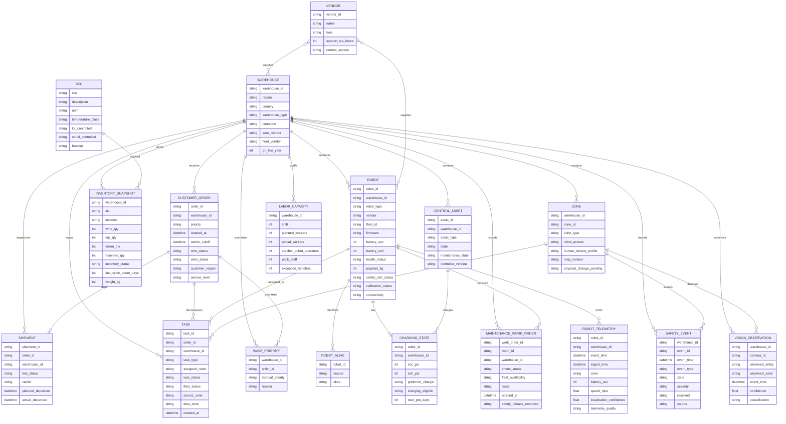

# CSV entity relationship diagram

**Scope:** Brownfield warehouse data under
`artifacts/api-server/brownfield/AI_FDE_AI_Native_Autonomous_Warehouse_Robotics_Control_Center_v2/data/`

**Analysis date:** 2026-09-24  
**Evidence basis:** CSV headers, row counts, shared-key overlap checks, and the
repository's data manifest and verification notes.

## Purpose and interpretation

This diagram describes the relationships represented by the CSV data files. It is a
logical data model, not a claim that every source is authoritative or that every
relationship is enforced by a database foreign key. The source package intentionally
contains competing system views and data-quality contradictions.

- **Confirmed relationship:** shared identifiers were found in both files and the
  relationship is supported by the column names and data grain.
- **Encoded relationship:** the relationship is derived from a structured identifier,
  such as `DC-01-Z03-B017` containing warehouse and zone information.
- **Reference relationship:** a descriptive name joins to a reference value, such as
  a vendor name, rather than to a stable vendor ID.
- **Observed relationship:** an event or observation points to a warehouse or zone but
  does not identify a robot or order directly.

## Entity relationship diagram

## CSV sources and entity grains

| Entity | CSV source | Rows | Candidate key / grain | Relationship role |
|---|---|---:|---|---|
| WAREHOUSE | `data/reference/warehouses.csv` | 18 | `warehouse_id` | Parent scope for operational and reference data |
| SKU | `data/reference/skus.csv` | 1,200 | `sku` | Product reference for inventory |
| VENDOR | `data/reference/vendors.csv` | 10 | `vendor_id`; `name` is a descriptive join value | Robot and warehouse vendor reference |
| ORDER | `data/raw/orders.csv` | 3,500 | `order_id` | Customer/order lifecycle and parent of tasks/shipments |
| SHIPMENT | `data/raw/shipments.csv` | 3,500 | `shipment_id`; one `order_id` per row in this extract | Carrier dispatch view of an order |
| TASK | `data/raw/tasks.csv` | 8,732 | `task_id` | Work decomposition and robot assignment |
| INVENTORY_SNAPSHOT | `data/raw/inventory_snapshot.csv` | 9,360 | likely `warehouse_id + location + sku`; not declared in CSV | Warehouse/SKU/location stock view |
| ROBOT | `data/raw/robots.csv` | 712 | `robot_id` | Fleet master and assignment target |
| ROBOT_ALIAS | `data/raw/robot_aliases.csv` | 2,136 | `robot_id + source` | Cross-system robot identity aliases |
| CHARGING_STATE | `data/raw/charging_state.csv` | 712 | `robot_id` | Robot battery/charging overlay |
| MAINTENANCE_WORK_ORDER | `data/raw/maintenance.csv` | 520 | `work_order_id` | CMMS/fleet maintenance evidence for robots |
| ROBOT_TELEMETRY | `data/telemetry/robot_telemetry.csv` | 12,896 | event grain; no event ID in CSV | Time-series robot observations |
| ZONE | `data/raw/zones.csv` | 216 | `warehouse_id + zone_id` | Warehouse physical/logical location reference |
| CONTROL_ASSET | `data/raw/control_assets.csv` | 918 | `asset_id` | Conveyors, chargers, pack stations, doors, gates, ASRS |
| LABOR_CAPACITY | `data/raw/labor_capacity.csv` | 54 | `warehouse_id + shift` | Warehouse staffing capacity by shift |
| SAFETY_EVENT | `data/raw/safety_events.csv` | 1,170 | `event_id` | Safety observations anchored to warehouse and zone |
| VISION_OBSERVATION | `data/telemetry/vision_observations.csv` | 214 | no declared event ID | Camera observations anchored to warehouse/zone |
| WAVE_PRIORITY | `data/shadow/wave_priority_FINAL_v7.csv` | 216 | likely `warehouse_id + order_id` | Shadow/manual priority overlay |

## Relationship evidence

### Confirmed shared-key relationships

| Parent | Child | Join key | Observed evidence |
|---|---|---|---|
| WAREHOUSE | ORDER | `warehouse_id` | All 18 warehouse IDs occur in orders |
| WAREHOUSE | SHIPMENT | `warehouse_id` | All 18 warehouse IDs occur in shipments |
| WAREHOUSE | TASK | `warehouse_id` | All 18 warehouse IDs occur in tasks |
| WAREHOUSE | ROBOT | `warehouse_id` | All 18 warehouse IDs occur in robots |
| WAREHOUSE | INVENTORY_SNAPSHOT | `warehouse_id` | All 18 warehouse IDs occur in inventory |
| WAREHOUSE | ZONE | `warehouse_id` | 18 warehouses x 12 zones = 216 rows |
| WAREHOUSE | CONTROL_ASSET | `warehouse_id` | All 18 warehouse IDs occur in control assets |
| WAREHOUSE | MAINTENANCE_WORK_ORDER | `warehouse_id` | All 18 warehouse IDs occur in maintenance |
| WAREHOUSE | LABOR_CAPACITY | `warehouse_id` | 18 warehouses x 3 shifts = 54 rows |
| WAREHOUSE | SAFETY_EVENT | `warehouse_id` | All 18 warehouse IDs occur in safety events |
| WAREHOUSE | VISION_OBSERVATION | `warehouse_id` | All 18 warehouse IDs occur in vision observations |
| WAREHOUSE | WAVE_PRIORITY | `warehouse_id` | All 18 warehouse IDs occur in shadow priorities |
| ORDER | SHIPMENT | `order_id` | 3,500 of 3,500 order IDs overlap |
| ORDER | TASK | `order_id` | 3,500 of 3,500 order IDs overlap |
| ORDER | WAVE_PRIORITY | `order_id` | 216 of 216 shadow order IDs overlap with orders |
| ROBOT | TASK | `robots.robot_id = tasks.assigned_robot` | All 712 robot IDs are represented among assigned task values |
| ROBOT | ROBOT_ALIAS | `robot_id` | All 712 robot IDs have aliases; 3 aliases per robot in the extract |
| ROBOT | CHARGING_STATE | `robot_id` | 712 of 712 robots have charging rows |
| ROBOT | MAINTENANCE_WORK_ORDER | `robot_id` | 520 maintenance robot IDs overlap; not every robot has a work order |
| ROBOT | ROBOT_TELEMETRY | `robot_id` | All 712 robot IDs occur in telemetry |
| SKU | INVENTORY_SNAPSHOT | `sku` | All 1,200 reference SKUs occur in inventory |
| ZONE | TASK | `source_zone` and `dest_zone` | Both task zone columns use the 216 zone IDs |
| ZONE | SAFETY_EVENT | `zone` | Safety event zones use the 216 zone IDs |
| ZONE | VISION_OBSERVATION | `observed_zone` | 144 of the 216 zones appear in vision observations |
| CONTROL_ASSET | CHARGING_STATE | `preferred_charger = asset_id` | Preferred charger values resolve to charger assets |

### Reference and encoded relationships

- `robots.vendor` joins to `vendors.name`, not `vendors.vendor_id`. The join is
  semantically supported but lacks a stable vendor foreign key in `robots.csv`.
- `warehouses.fleet_vendor` and `warehouses.wms_vendor` are names or system labels.
  `fleet_vendor` matches four vendor reference names; `wms_vendor` has no matching
  row in `vendors.csv` because the vendor reference contains robotics, vision,
  conveyor, sorter, ASRS, IoT, and safety vendors rather than WMS vendors.
- `inventory_snapshot.location` encodes warehouse, zone, and bin, for example
  `DC-01-Z03-B017`. The CSV has no separate `zone_id` or `bin_id` column, so the
  inventory-to-zone relationship is derived from the identifier format.
- `tasks.source_zone`, `tasks.dest_zone`, `safety_events.zone`, and
  `robot_telemetry.zone` are direct zone-like identifiers. They should be joined
  using the composite key `warehouse_id + zone_id` because zone IDs are scoped to a
  warehouse.
- `charging_state.preferred_charger` identifies a control asset by its structured
  asset ID. This is a logical link; there is no explicit `charger_id` column.
- `vision_observations.observed_entity` is not a stable foreign key to `robot_id`,
  `order_id`, or `asset_id` in the inspected schema. Do not infer a robot link from
  the text alone.

## Quality and modeling cautions

- `warehouse_legacy.db` and the CSVs are source evidence, not necessarily one
  consistent system of record. The repository reports inventory truth conflicts,
  WES/fleet task conflicts, maintenance/availability conflicts, alias collisions,
  expired connected robots, and duplicate telemetry packets.
- `orders.csv` and `shipments.csv` contain one matching order population in the
  supplied extract, but this is an observed snapshot relationship, not a declared
  database constraint.
- `tasks.csv` can contain multiple tasks per order and repeated task types. Task
  rows represent observed work records, not necessarily a clean workflow sequence.
- `maintenance.csv` is one-to-many from robot to work order in the logical model,
  but only 520 maintenance rows exist for 712 robots.
- `robot_telemetry.csv` has no explicit telemetry event key, so event identity may
  require a composite of robot, event time, ingest time, and source fields.
- `vision_observations.csv` has no event ID and only covers a subset of zones. It is
  an observation stream, not a complete zone or robot inventory.
- `labor_capacity.csv` has a natural composite grain of warehouse and shift; it is
  not directly linked to orders or tasks in the CSV set.
- `wave_priority_FINAL_v7.csv` is a shadow/manual overlay. It contains only 216
  order rows and should not be treated as a complete priority table.
- CSV relationship analysis cannot establish cardinality guarantees where the files
  lack uniqueness constraints. Cardinalities in the diagram represent the observed
  logical model and expected domain meaning.

## Analysis summary

The central hub is `WAREHOUSE`. The order flow is:

`WAREHOUSE -> ORDER -> SHIPMENT`

and independently:

`ORDER -> TASK -> ROBOT`, with task movement between `ZONE` records.

The fleet and maintenance flow is:

`WAREHOUSE -> ROBOT -> {CHARGING_STATE, MAINTENANCE_WORK_ORDER, ROBOT_TELEMETRY, ROBOT_ALIAS}`.

The inventory/reference flow is:

`WAREHOUSE -> INVENTORY_SNAPSHOT -> SKU`, with location-to-zone inferred from
encoded location IDs. Safety and vision are warehouse/zone observation streams, not
complete robot-level event sources.
