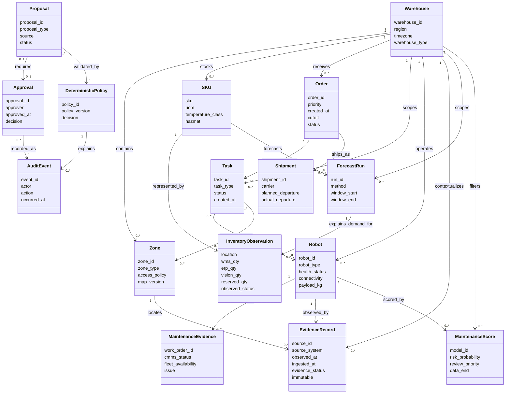

# Repository ontology

**Case:** Autonomous Warehouse Robotic Control Tower  
**Scope:** Brownfield warehouse evidence, V3 simulator state, and advisory intelligence  
**Status:** Working ontology  
**Date:** 2026-09-24  
**Related vocabulary:** `11_UBIQUITOUS_LANGUAGE.md`

## Purpose

This ontology defines the concepts and relations shared across the repository. It is
intended to support domain modelling, API contracts, evidence traceability, test
cases, and future knowledge-sharing or retrieval work.

The ontology is deliberately layered:

- **Evidence layer:** immutable observations imported from CSV, JSONL, legacy SQLite,
  telemetry, and reference files.
- **Runtime layer:** mutable local simulator state representing orders, reservations,
  tasks, claims, lifecycle, interventions, forecasts, and audit.
- **Advisory layer:** forecasts, predictive-maintenance scores, replay results, and
  LLM proposals that inform review but do not independently authorize operational
  action.
- **Authority layer:** human roles and deterministic policies that decide whether a
  state transition is allowed.

A relation between two concepts does not imply that either source is physically true,
that the relation is enforced by a database foreign key, or that the relation permits
a write or command.

## Ontology conventions

| Convention | Meaning |
|---|---|
| `Class` | A type of domain object or record |
| `Data property` | Attribute carried by an instance |
| `Object property` | Relation between two instances |
| `Evidence status` | `observed`, `derived`, `simulated`, `advisory`, or `unknown` |
| `Authority` | Actor or deterministic component allowed to make a decision |
| `Scope` | Warehouse, SKU, robot, order, task, zone, or snapshot boundary |
| `Immutable` | Imported evidence must not be overwritten by the application |
| `Versioned` | An output or decision is tied to a method, revision, model, or snapshot |

## Top-level ontology

## Core classes

### 1. Place and catalogue

| Class | Definition | Key identity | Evidence/runtime status |
|---|---|---|---|
| `Warehouse` | Distribution-center scope containing work, stock, resources, zones, and observations | `warehouse_id` | Evidence and runtime |
| `Zone` | Warehouse-scoped physical/logical area | `warehouse_id + zone_id` | Evidence |
| `Location` | Stock location, often encoded with warehouse and zone | source location value | Evidence; zone link may be derived |
| `SKU` | Product catalogue item with unit, temperature, lot, serial, and hazmat properties | `sku` | Reference evidence |
| `Vendor` | Equipment/service organization referenced by name or vendor ID | `vendor_id` or source name | Reference evidence |
| `ControlAsset` | Conveyor, charger, pack station, dock door, vision gate, or ASRS resource | `asset_id` | Evidence and runtime overlay |
| `LaborCapacity` | Staff capacity for a warehouse and shift | `warehouse_id + shift` | Evidence |

### 2. Demand and movement

| Class | Definition | Key identity | Invariants |
|---|---|---|---|
| `BazaarOrder` | Customer-facing order request entering through Bazaar | Bazaar order ID | Has stable request identity and outbox delivery |
| `RequestIdentity` | Stable request/body fingerprint for idempotent handoff | request ID + body fingerprint | Same identity with changed body is rejected |
| `ParentOrder` | Accepted Core aggregate for fulfillment | Core order ID | Acceptance is atomic within the selected warehouse |
| `SubOrder` | SKU/warehouse-scoped work derived from a parent order | sub-order ID | Tracks line-level fulfillment |
| `Allocation` | Assignment of quantity to an eligible source/warehouse/location | allocation ID | Does not itself mean picked |
| `Task` | Unit of staged simulated warehouse work | task ID | Uses `Pick`, `Move`, `Pack_feed`, `Stage` in V3 |
| `Progress` | Durable projection of order and stage advancement | order/progress ID | Must not claim completion from an unverified source |
| `Shipment` | Carrier dispatch record related to an order | shipment ID | Planned and actual departure are distinct |
| `Outbox` | Durable retry record for Bazaar-to-Core delivery | outbox ID | Persists before handoff and supports retry |

### 3. Inventory accounting

| Class | Definition | Key identity | Invariants |
|---|---|---|---|
| `InventoryObservation` | Source-specific quantity observation from WMS, ERP, vision, or another source | warehouse + SKU + location + source context | Conflicting observations remain visible |
| `FreeQuantity` | Conservative eligible nonnegative availability used for allocation | warehouse + SKU/location | Current source minimum; debited once at allocation |
| `Reservation` | Quantity committed to accepted work before Pick | reservation ID | Pick releases reservation; no second free debit |
| `PickedQuantity` | Quantity moved into picked/in-process state | movement/order/location identity | Protected from direct correction |
| `Movement` | Durable quantity transition event | movement ID | Idempotent across retry/restart |
| `Shortage` | Insufficient eligible quantity for a requested line | order + warehouse + SKU | New Bazaar request rejects atomically |
| `InventoryCorrection` | Approved update to app-owned modeled source state | correction/intervention ID | Cannot overwrite protected reservation/picked accounting |

### 4. Fleet and readiness

| Class | Definition | Key identity | Invariants |
|---|---|---|---|
| `Robot` | Resource record with type, capacity, health, certification, and connectivity | `robot_id` | Evidence record, not live control authority |
| `RobotAlias` | Cross-system identity representation for a robot | robot + source + alias | Alias collisions are first-class diagnostics |
| `RobotTelemetry` | Time-series robot observation | event composite | Observation stream; not automatically ground truth |
| `BatteryState` | Persisted simulator charge/health state | robot ID | Separate from predictive maintenance score |
| `ChargingState` | Persisted simulator charging condition and preferred charger | robot ID | Charging can block new assignment |
| `MaintenanceEvidence` | CMMS/fleet maintenance record used for readiness | work-order ID | Blocking evidence fails closed |
| `MaintenanceHold` | Hard feasibility constraint until authorized technical release | robot/resource + evidence | Cannot be cleared by a predictive score |
| `Eligibility` | Deterministic assessment of resource suitability for a stage | resource + stage + policy version | Checks readiness, capacity, warehouse, claims, and blockers |
| `Claim` | Exclusive ownership of a resource for a simulated task | claim/token ID | Prevents conflicting assignment |
| `AssignmentToken` | Revision-aware token for task admission/progress | token ID | Rejects stale or duplicate transitions |
| `FailureBlock` | Simulator block after resource failure/kill | resource + assignment | Recovery removes only this simulator block |
| `Replacement` | Same-stage selection of another eligible simulated resource | replacement ID | Preserves completed work and accounting |
| `Recovery` | Explicit workflow for resuming after simulator failure | recovery ID | Does not bypass independent safety/readiness blockers |

### 5. Intelligence and review

| Class | Definition | Key identity | Authority |
|---|---|---|---|
| `ForecastRun` | Versioned warehouse/SKU demand calculation and input capture | run ID | Advisory planning only |
| `DailyInput` | Attributable warehouse/SKU/day demand used by a forecast | run + warehouse + SKU + date | Explains forecast; does not mutate stock |
| `ForecastItem` | Forecast output for one warehouse/SKU pair | run + warehouse + SKU | Does not authorize allocation |
| `Coverage` | History state such as observed, short history, or no history | forecast item | Not a confidence guarantee |
| `ModelCard` | Versioned model intent, data, features, metrics, and limitations | model ID/hash | Governance evidence |
| `RetrospectiveScore` | Frozen predictive-maintenance output for a robot | model + robot + observation date | Human review only |
| `ReviewPriority` | `review`, `monitor`, or `unavailable` display category | score row | Cannot change readiness or health |
| `Proposal` | Structured advisory suggestion such as transfer or task grouping | proposal ID | Requires validation and, where applicable, human approval |
| `Candidate` | Potentially feasible proposal element | candidate ID | Must be independently and jointly validated |
| `ValidatedPlan` | Proposal accepted by deterministic validation for a snapshot | plan ID | Still not dispatch or physical control |
| `Approval` | Explicit human decision on a validated proposal | approval ID | Must be attributable, fresh, and audited |
| `CompareRun` | Baseline-versus-proposal simulation result | compare ID | Evidence for review, not observed business value |

### 6. Evidence, authority, and governance

| Class | Definition | Key identity | Authority |
|---|---|---|---|
| `EvidenceRecord` | Immutable or versioned source observation | source record ID or composite | Describes evidence, not necessarily truth |
| `SourceRecord` | Imported row/document from a named source | source + row identity | Immutable evidence |
| `SourceConflict` | Disagreement between source observations/statuses | entity + source set | Requires review; no silent normalization |
| `Uncertainty` | Missing, stale, contradictory, or incomplete evidence | diagnostic ID | Requires explicit handling |
| `Diagnostic` | Structured data-quality or operational finding | diagnostic ID | Informs intervention/review |
| `Issue` | Workflow record requiring investigation or correction | issue ID | Does not itself change source truth |
| `Proposal` | Human/system suggestion within an intervention workflow | proposal ID | Requires role-appropriate approval |
| `Verification` | Evidence that an approved change or resolution was checked | verification ID | Closes only the intended issue |
| `AuditEvent` | Durable actor/action/time/before-after record | event ID | Required for consequential workflow changes |
| `Persona` | Demo workflow scope such as Supervisor, Fleet, Admin, Reviewer | persona value | Not secure identity |
| `DecisionAuthority` | Human role or deterministic component allowed to decide | authority policy | LLM text/score alone is never authority |
| `DeterministicPolicy` | Versioned rule set for allocation, readiness, validation, and state transitions | policy ID/version | Authoritative for hard constraints |
| `Snapshot` | Frozen source/runtime state used for replay or proposal evaluation | snapshot ID | Bounds reproducibility and staleness |

## Object properties

### Structural properties

| Property | Domain | Range | Cardinality/semantics |
|---|---|---|---|
| `containsZone` | `Warehouse` | `Zone` | One warehouse contains many zones |
| `containsResource` | `Warehouse` | `Robot` or `ControlAsset` | Resource belongs to a warehouse scope |
| `stocksSKU` | `Warehouse` | `SKU` / `InventoryObservation` | Stock is warehouse and location scoped |
| `decomposesInto` | `ParentOrder` | `SubOrder` / `Task` | Order becomes executable work |
| `shipsAs` | `Order` | `Shipment` | Shipment is a carrier-facing view |
| `assignedTo` | `Task` | `Robot` or `ControlAsset` | Assignment is simulated and policy-bound |
| `movesBetween` | `Task` | `Zone` | Source/destination zone relation |
| `represents` | `InventoryObservation` | `SKU` | Observation identifies product |
| `hasMaintenanceEvidence` | `Robot` | `MaintenanceEvidence` | One robot may have many records |
| `hasAlias` | `Robot` | `RobotAlias` | Cross-system identity mapping |
| `emitsTelemetry` | `Robot` | `RobotTelemetry` | Time-series observation |

### Decision and evidence properties

| Property | Domain | Range | Rule |
|---|---|---|---|
| `scopedByWarehouse` | Most operational classes | `Warehouse` | Warehouse scope must not be inferred away |
| `derivedFrom` | Runtime/advisory object | `EvidenceRecord` or `Snapshot` | Preserve provenance |
| `contradicts` | `EvidenceRecord` | `EvidenceRecord` | Conflict is retained, not silently resolved |
| `evaluatedBy` | `Eligibility` / `ValidatedPlan` | `DeterministicPolicy` | Policy version must be traceable |
| `blocks` | `MaintenanceEvidence` / `FailureBlock` | `Robot`, `Task`, or `Resource` | Blocking evidence fails closed |
| `claims` | `Claim` | `Robot` or `ControlAsset` | Claims are exclusive |
| `requiresApproval` | `Proposal` | `Approval` | Human gate before future operational application |
| `approvedBy` | `Approval` | `Persona` / authenticated actor | Demo persona is not production identity |
| `auditedBy` | Decision or correction | `AuditEvent` | Consequential changes need traceability |
| `cannotAuthorize` | `ForecastItem`, `RetrospectiveScore`, `LLM Proposal` | Tasks, reservations, claims, physical control | Advisory outputs never become authority by themselves |

## Formal business constraints

### Scope and identity

1. Every operational order, task, robot, inventory observation, zone, asset, and
   maintenance record has a warehouse scope or an explicit reason why it does not.
2. `warehouse_id` is part of the identity interpretation for warehouse-scoped IDs.
3. A request identity with a changed body is rejected.
4. Imported brownfield evidence is immutable; application corrections write only to
   app-owned modeled state.
5. Alias collisions and cross-system identity conflicts remain diagnosable facts.

### Fulfillment and accounting

1. New Bazaar acceptance is all-or-nothing inside the selected warehouse.
2. Free quantity is a conservative nonnegative source minimum and is debited once at
   allocation.
3. Pick releases reservation and creates picked/in-process state without a second
   free-stock debit.
4. Movement effects are durable and idempotent across retries and restarts.
5. Protected reservation and picked totals cannot be directly overwritten by a source
   correction.
6. An accepted shortage hold has no reservation; a resource wait does not erase an
   accepted reservation.

### Readiness and lifecycle

1. Missing or blocking readiness evidence prevents assignment.
2. Resource claims are exclusive.
3. Maintenance holds remain hard constraints until authorized technical release.
4. Recovery cannot duplicate completed work or movement effects.
5. A replacement must pass the same deterministic eligibility policy as any new
   assignment.
6. No ontology instance grants physical control of a robot, PLC, WMS, FMS, or ERP.

### Intelligence and advisory control

1. A demand forecast is advisory and does not determine allocation eligibility.
2. A retrospective maintenance score is not live health, diagnosis, safety, or a hold.
3. An LLM proposal must be bounded by a snapshot/context and validated before
   retention or comparison.
4. Invalid, stale, overlapping, infeasible, or malformed plans are rejected; no hidden
   heuristic repairs them.
5. Human approval, where required, is separate from proposal generation and validation.
6. Provider failure creates no substitute operational decision.

## Ontology mappings to repository artifacts

| Ontology area | Primary repository evidence |
|---|---|
| Brownfield entities and observations | `artifacts/fde-artefacts/10_CSV_ENTITY_RELATIONSHIP_DIAGRAM.md` |
| Shared vocabulary | `artifacts/fde-artefacts/11_UBIQUITOUS_LANGUAGE.md` |
| Bounded contexts and invariants | `artifacts/fde-artefacts/02_DOMAIN_WORKFLOWS_AND_CONTROLS.md` |
| Logical ER vocabulary | `artifacts/fde-artefacts/08_DOMAIN_ER_DIAGRAM.md` |
| Runtime fulfillment policy | `artifacts/api-server/CONTROL_TOWER.md`, `FULFILLMENT_API.md`, `fulfillment_v2.py` |
| Intake and request identity | `artifacts/api-server/BAZAAR_API.md`, `bazaar_api.py` |
| Intervention and audit | `artifacts/api-server/PERSONA_API.md`, `persona_api.py` |
| Detached proposal validation | `artifacts/api-server/BATCHING_CONTRACT.md`, `batching_api.py` |
| Forecasting | `artifacts/api-server/demand_forecast.py` |
| Maintenance intelligence | `artifacts/api-server/predictive_api.py`, `models/predictive-maintenance/model_card.md` |
| Requirements and constraints | `artifacts/fde-artefacts/04_REQUIREMENTS_TRACEABILITY.md`, `PRD.md` |

## Scope and limitations

- This is a conceptual ontology, not an OWL/RDF serialization and not a generated
  database schema.
- Cardinalities express intended domain meaning and observed repository shape; CSV
  files do not enforce all keys or constraints.
- Brownfield values intentionally contain contradictions and incomplete evidence.
- Runtime SQLite entities are richer than the brownfield CSV entities and are not
  interchangeable without an explicit mapping.
- Advisory scores, forecasts, replay results, and LLM proposals must retain labels
  that distinguish them from operational truth.
- Production identity, authentication, RBAC, external integrations, physical safety,
  and live robot control are outside the ontology's current implementation boundary.

## Review checklist

- [x] Evidence, runtime, advisory, and authority layers are distinct.
- [x] Core warehouse, fulfillment, inventory, fleet, intelligence, and governance
  classes are defined.
- [x] Object properties and important constraints are explicit.
- [x] Forecast, maintenance score, and LLM proposal authority boundaries are stated.
- [x] Repository mappings provide traceability to implementation evidence.
- [x] Limitations avoid claiming physical truth or production authorization.
