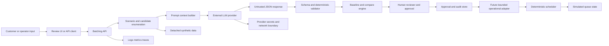

# Threat model: LLM order-task grouping with human approval

**Case:** Autonomous Warehouse Robotic Control Tower  
**Use case:** Generate grouping proposals for existing queued order tasks in a warehouse  
**Status:** Threat model for detached proposal flow and future controlled adoption  
**Date:** 2026-09-25  
**Primary references:** `ADR-011-llm-task-grouping-human-approval.md`,
`BATCHING_CONTRACT.md`, `batching_api.py`, `05_PRODUCTION_READINESS.md`

## 1. System definition

The use case asks an LLM to inspect a bounded queue/scenario for one warehouse and
suggest a non-overlapping set of compatible order groups. A group is useful only when
it remains feasible under payload, robot/asset readiness, proximity, stage timing,
downstream contention, and order cutoffs.

The LLM is a **proposal generator**, not a dispatcher. The intended decision sequence is:

1. Build or retrieve a bounded queue/snapshot.
2. Enumerate candidate groups and exclusions deterministically.
3. Send only the required context to the configured LLM provider.
4. Parse the structured response.
5. Validate identifiers, membership, overlap, combined feasibility, capacity, timing,
   deadlines, and scenario identity deterministically.
6. Present the validated proposal, reasons, exclusions, and baseline comparison to an
   authorized human reviewer.
7. Record approve/reject/expire with identity, revision, model, snapshot, validation,
   and rationale.
8. If future operational application is enabled, revalidate immediately before any
   bounded state transition; approval never authorizes physical control.

The current package implements the detached synthetic proposal and comparison path. It
does not persist a production human-approval record or import the proposal into live
fulfillment state.

## 2. Security objectives

| Objective | Required outcome |
|---|---|
| Safety | No proposal can bypass readiness, payload, deadline, maintenance, or exclusive-claim constraints |
| Authority | LLM output cannot create tasks, reservations, claims, or physical commands |
| Integrity | A proposal is tied to an immutable/bounded snapshot and is rejected when stale or changed |
| Confidentiality | Only approved minimum queue/scenario data is sent to the provider; secrets never enter prompts or errors |
| Accountability | Human approval is attributable, role-authorized, time-stamped, and auditable |
| Availability | Provider outage or malformed output fails closed without hidden heuristic fallback |
| Reproducibility | Model, prompt/template, provider, context hash, policy version, and validation result are retained |
| Resilience | Partial failure, retries, duplicate requests, and concurrent queue changes do not create duplicate work |

## 3. Asset inventory

| Asset | Sensitivity / integrity need | Consequence of compromise |
|---|---|---|
| Queue/scenario snapshot | High integrity; potentially operationally sensitive | Unsafe or commercially harmful grouping recommendation |
| Order IDs, cutoffs, lines, locations, tote IDs | Confidentiality and integrity | Deadline manipulation, leakage, wrong grouping, customer impact |
| Robot/resource readiness and capacity | High integrity and safety relevance | Infeasible or unsafe group selection |
| Candidate set and exclusions | High integrity | Hidden omission or biased plan |
| LLM prompt/template and provider configuration | High confidentiality/integrity | Prompt injection, provider abuse, inconsistent output |
| LLM response | Untrusted input; integrity must be proven by validator | Invalid grouping, fabricated IDs, misleading rationale |
| Deterministic validator | Critical integrity | Constraint bypass or false acceptance |
| Human approval record | Critical accountability/integrity | Unauthorized or untraceable operational decision |
| Queue revision/fingerprint | Critical freshness/integrity | Approval of stale plan against changed work |
| Baseline and compare results | High integrity | False savings or deadline claims |
| Audit logs and telemetry | High integrity/availability | Loss of accountability and incident evidence |
| Provider API key and secrets | Critical confidentiality | Unauthorized spend, data exfiltration, account compromise |

## 4. Attack-surface map

### Attack-surface components

| Surface | Threat entry | Trust level | Required treatment |
|---|---|---|---|
| Scenario ID/request parameters | Tampered ID, oversized input, replay | Untrusted | Strict schema, bounded size, snapshot lookup, rate limit |
| Scenario/queue source | Poisoned or stale order/resource data | Evidence-dependent | Provenance, freshness, integrity hash, deterministic filtering |
| Prompt context | Prompt injection in order text/reason fields or data values | Untrusted data | Delimit data, exclude instructions, minimize fields, treat all content as data |
| Provider boundary | Network, API key, model service, retention policy | External/untrusted | TLS, secret manager, egress policy, provider contract, redaction, timeout |
| LLM response | Fabricated IDs, duplicate groups, malicious text, oversized JSON | Fully untrusted | Parse as data only, strict schema, allowlists, size limits, validator |
| Validator | Logic bypass, incomplete checks, policy drift | Critical trusted component | Independent tests, fail-closed behavior, versioning, no LLM-generated rules |
| Compare engine | False savings, deadline omissions, resource contention errors | Trusted only after tests | Recompute from same snapshot, invariant tests, no model-provided metrics |
| Human approval | Social engineering, reviewer fatigue, stale context, impersonation | High-risk human boundary | Authenticated RBAC, clear diff, freshness, dual control for high impact |
| Operational adapter | Unauthorized import/dispatch | Highest risk | Separate service boundary, deny by default, idempotency, kill switch, shadow mode |
| Logs/audit | Sensitive data leakage or tampering | Trusted evidence | Structured redaction, append-only controls, correlation IDs, retention |

## 5. Trust boundaries

| Boundary | From | To | Trust assumption | Security control |
|---|---|---|---|---|
| TB-01 | Browser/client | Batching API | Client may be malicious or merely mistaken | Authentication/RBAC before shared use, request validation, rate limiting |
| TB-02 | Evidence/queue source | Scenario builder | Source can be stale, contradictory, or poisoned | Provenance, schema checks, freshness, immutable snapshot, conflict visibility |
| TB-03 | Scenario builder | Prompt context | Data is not instruction | Delimit untrusted fields, minimize context, prompt-injection tests |
| TB-04 | Local API | External LLM provider | Provider is outside the application trust domain | TLS, secret isolation, approved endpoint, no sensitive unnecessary fields, timeout |
| TB-05 | LLM response | Application validator | Response is completely untrusted | JSON parsing, output schema, allowlists, deterministic validation, no execution |
| TB-06 | Validator | Human reviewer | Validator is trusted for hard constraints; reviewer is accountable for choice | Versioned policy, explanation, visible exclusions, approval identity and reason |
| TB-07 | Approval record | Operational adapter | Approval is valid only for exact snapshot/revision and scope | Recheck freshness and policy, authorization, expiry, idempotency, deny by default |
| TB-08 | Application | Physical/external systems | No trust or connection exists in current repo | Keep adapter absent; require separate safety case and release gate |
| TB-09 | Application | Logs/provider telemetry | Logs may contain sensitive order and topology data | Redaction, access control, retention, tamper evidence |

## 6. Abuse cases

| ID | Abuse case | Attacker/precondition | Impact | Detection | Mitigation / guardrail |
|---|---|---|---|---|---|
| AC-01 | Prompt injection in order IDs, reasons, or scenario text instructs the model to ignore constraints | Malicious or compromised source text | Unsafe/biased proposal or data disclosure | Suspicious instruction patterns, proposal reason review, validator rejection | Treat all scenario values as data; fixed system prompt; no tool access; deterministic allowlists |
| AC-02 | Fabricated candidate IDs or orders | LLM hallucination or crafted response | Proposal references nonexistent work | Unknown-ID validation error | Candidate IDs must come only from server enumeration; reject unknown IDs |
| AC-03 | Duplicate or overlapping groups | LLM error or adversarial output | Same order grouped twice or omitted | Combined-plan validation | Reject duplicate IDs, overlap, missing membership, and revalidate combined selection |
| AC-04 | Heavy or incompatible order grouped with others | Model ignores payload/capability limits | Resource overload or infeasible plan | Payload/capability validator | Server-owned candidate set; exact payload and capability checks |
| AC-05 | Deadline manipulation | Model or source changes cutoff interpretation | Late order or unfair prioritization | Compare output against source cutoff; cutoff invariant tests | Server-owned cutoff values; deterministic full downstream deadline check |
| AC-06 | Exclusion laundering | LLM omits difficult orders or invents benign reasons | Hidden service degradation | Compare selected IDs to full queue and exclusions | Require explicit exclusions and reason; reviewer sees unselected orders |
| AC-07 | False savings claim | Model supplies metrics or rationale not recomputed by engine | Reviewer approves based on fabricated benefit | Difference between model text and engine metrics | Metrics are engine-generated only; model cannot submit savings values |
| AC-08 | Stale-plan approval | Queue changes after proposal generation | Approved grouping no longer feasible | Snapshot/revision mismatch | Expire proposal; re-read and revalidate at approval/application |
| AC-09 | Approval impersonation | Caller-controlled persona or stolen session | Unauthorized operational decision | Audit identity mismatch and access logs | Production IAM/RBAC, approver binding, step-up/dual approval |
| AC-10 | Automatic execution path introduced accidentally | Developer enables import or tool call | LLM gains operational authority | Route/import dependency tests; outbound command monitoring | No operational import in current sandbox; deny-by-default adapter and kill switch |
| AC-11 | Provider prompt/data retention leaks order or topology details | Provider logs or misuse | Confidentiality breach | Egress and provider audit | Data minimization, redaction/tokenization, contractually bounded retention |
| AC-12 | Oversized response or repeated requests cause cost/resource exhaustion | Malicious client or provider behavior | API/LLM spend denial of service | Token, body, duration, concurrency, and spend metrics | Request limits, single-flight, bounded response, timeout, circuit breaker |
| AC-13 | Malicious proposal reason creates stored XSS or log injection | Crafted LLM output | Reviewer compromise or corrupted audit | Output encoding and log validation | Render as text, sanitize, length limits, structured logs |
| AC-14 | Model/provider substitution changes behavior | Supply-chain or configuration compromise | Unreviewed grouping policy shift | Model/provider identity drift alerts | Pin approved model/config, hash prompt/policy, change approval |
| AC-15 | Validator is bypassed through alternate endpoint | Route or module misuse | Invalid plan retained or applied | Endpoint inventory and contract tests | Single validation gateway; deny direct engine import from write path |
| AC-16 | Cross-warehouse contamination | Scenario/ID mismatch or crafted warehouse field | Work grouped across warehouse boundaries | Warehouse-scope validation | Server-owned warehouse scope; exact scenario ID and warehouse checks |
| AC-17 | Human over-trusts fluent explanation | Reviewer accepts plausible narrative without evidence | Poor grouping decision | Approval outcome and reason analysis | Show raw evidence, validator errors, baseline, assumptions, and reviewer checklist |
| AC-18 | Failure response is replaced by hidden heuristic | Provider timeout or malformed result | Unreviewed grouping decision | Audit provider failure and result source | No fallback substituted; return explicit failure and retain no plan |

## 7. OWASP Top 10 for LLM Applications mapping

The names below follow the OWASP Top 10 for LLM Applications taxonomy. OWASP
versions may rename or reorder categories; the threat/control mapping should be
rechecked when the target standard is baselined.

| OWASP LLM risk | Relevance | Repo-specific exposure | Controls / evidence |
|---|---|---|---|
| LLM01 Prompt Injection | High | Scenario fields or candidate reasons can contain instructions; provider context is model-visible | Data/instruction separation, minimal context, fixed prompt, no tools, deterministic validation, AC-01 |
| LLM02 Sensitive Information Disclosure | High | Order IDs, cutoffs, locations, topology, and resource data may leave the trust boundary | Minimize/redact/tokenize, provider contract, egress controls, retention limits, AC-11 |
| LLM03 Supply Chain | High | Model, endpoint, SDK, prompt template, and provider configuration can change | Pin approved model/provider, dependency scanning, config approval, artifact hashes, AC-14 |
| LLM04 Data and Model Poisoning | High | Poisoned queue/scenario evidence or manipulated candidate context biases grouping | Immutable snapshots, provenance, source conflict detection, freshness, independent candidate enumeration |
| LLM05 Improper Output Handling | Critical | LLM returns IDs, reasons, exclusions, and summary consumed by application/UI | Parse as data, schema/length limits, allowlists, output encoding, deterministic validator, AC-02/AC-13 |
| LLM06 Excessive Agency | Critical | Future operational adapter could convert a proposal into grouping/dispatch | Human approval, no current operational import, revalidation, deny-by-default adapter, AC-10 |
| LLM07 System Prompt Leakage | Medium | Prompt contains rules about candidate selection and non-dispatch boundary | Do not treat prompt secrecy as a control; enforce rules in code and validator; minimize sensitive prompt content |
| LLM08 Vector and Embedding Weaknesses | Low/current, possible future | No vector store is used in the current batching path; future retrieval could add poisoned context | Keep out of scope unless introduced; signed/indexed source chunks and retrieval provenance |
| LLM09 Misinformation | High | Fluent reasons or summaries may claim infeasibility/savings not supported by evidence | Recompute metrics, show source fields, label uncertainty, reviewer approval, AC-07/AC-17 |
| LLM10 Unbounded Consumption | High | Repeated suggestions, oversized context/response, provider retries | Context/token/body caps, single-flight, rate limits, timeout, circuit breaker, spend alerts, AC-12 |

## 8. OWASP Top 10 for Agentic Applications mapping

This mapping uses the OWASP Agentic Applications threat themes commonly described
for agentic systems. The current path is intentionally **not an autonomous agent**:
it has no tool-calling loop, memory, planner execution, or physical action. The
mapping identifies what would become relevant if proposal generation is expanded.

| OWASP Agentic risk | Relevance | Repo-specific scenario | Controls / release requirement |
|---|---|---|---|
| Agent Goal Hijack | High | Prompt injection changes the grouping objective from deadline/resource safety to speed or hidden preference | Fixed objective, trusted server policy, data/instruction separation, reviewer-visible objective |
| Tool Misuse and Exploitation | Critical if tools added | Future agent could call import, scheduler, database, or external adapter | No tools today; capability allowlist, read-only tool credentials, typed APIs, approval gate |
| Identity and Privilege Abuse | Critical | Caller-controlled demo persona is not secure identity; approval authority could be impersonated | Production IAM, server-side RBAC, approver binding, least privilege, dual control |
| Supply Chain Vulnerabilities | High | Provider/model/SDK/prompt/configuration substitution | Pin/hashes, SBOM, signed artifacts, change management, model/provider allowlist |
| Unexpected Code or Command Execution | Critical if execution added | LLM output might be passed to shell, SQL, API, or robot command path | Treat output as data, no dynamic execution, parameterized APIs, no OT adapter, security tests |
| Memory and Context Poisoning | Medium/current, high if memory added | Cached proposal/context or future long-lived memory could retain poisoned grouping assumptions | Snapshot-scoped context, bounded cache, provenance, expiry, no persistent model memory |
| Insecure Inter-Agent Communication | Low/current | No agent-to-agent protocol; future planner/validator/reviewer agents could disagree or be spoofed | Authenticated service identities, signed messages, schema/version checks, replay protection |
| Cascading Failures | High | Provider retry storms, validator failure, stale approvals, or bad grouping can amplify queue delay | Circuit breaker, no fallback, bounded retries, isolation, queue age alarms, manual fallback |
| Human-Agent Trust Exploitation | High | Fluent explanation, false savings, urgency, or reviewer fatigue can produce rubber-stamp approval | Evidence-first UI, approval checklist, reason capture, training, sampling, dual approval |
| Rogue or Misaligned Agent Behavior | Critical if autonomy added | Agent could optimize makespan while violating cutoff, payload, safety, or warehouse scope | Deterministic policy authority, hard validators, kill switch, shadow mode, TEVV, no autonomous dispatch |

## 9. Guardrails

### 9.1 Preventive guardrails

| Layer | Guardrail | Owner | Status |
|---|---|---|---|
| Data | Use server-generated candidate IDs; do not let model invent queue objects | Fulfillment engineering | Current |
| Data | Snapshot/hash queue, warehouse, cutoff, resource, and constraint context | Platform/fulfillment | Required for operational adoption |
| Prompt | Delimit all scenario values as untrusted data; never interpret order text as instructions | AI/platform | Required |
| Provider | Minimize context, redact secrets/PII, pin approved provider/model, enforce TLS and egress | Security/platform | Required beyond local demo |
| Output | Require strict JSON shape, bounded strings/lists, known candidate membership | API engineering | Current |
| Validation | Revalidate individual and combined candidates; check overlap, payload, readiness, deadlines, contention | Fulfillment engineering | Current |
| Authorization | Require authenticated approver with role and warehouse scope | Security/operations | Not implemented for shared use |
| Freshness | Expire on scenario/revision/policy/model change; revalidate immediately before application | Fulfillment engineering | Architectural requirement |
| Execution | Keep proposal path detached/read-only; no import to operational fulfillment | Architecture | Current |

### 9.2 Detective guardrails

- Log correlation ID, scenario hash, warehouse, model/provider identity, prompt-template
  version, candidate IDs, validation errors, compare result, and approval outcome.
- Alert on unknown IDs, repeated validation failures, cross-warehouse references,
  deadline misses, high exclusion rates, provider drift, token spikes, and retry storms.
- Compare model-provided narrative claims with server-computed metrics; never store
  unverified savings as fact.
- Sample approved and rejected proposals for reviewer agreement, false feasibility,
  missed deadlines, and systematic warehouse/order bias.
- Monitor queue age, approval latency, plan expiry rate, validation rejection rate,
  provider availability, and downstream incidents.

### 9.3 Corrective and containment guardrails

- Reject the entire proposal on parse, schema, freshness, authorization, or validation
  failure; do not repair it silently.
- Disable the provider and retain a deterministic singleton/baseline review path.
- Revoke approval if snapshot, queue, policy, model, or provider identity changes.
- Use a kill switch that disables proposal generation and any future import adapter.
- Quarantine suspicious prompts/responses for security review without re-sending them.
- Preserve completed work and inventory movement identities during any rollback.
- Roll back to the deterministic scheduler/baseline; never roll back by replaying raw
  LLM output into operational state.

## 10. Approval checklist for a future operational pilot

Before a validated grouping proposal can affect an operational queue:

- [ ] Authenticated human identity and warehouse-scoped RBAC are enforced server-side.
- [ ] Proposal is tied to an immutable queue snapshot and current revision/fingerprint.
- [ ] Candidate IDs, order membership, warehouse, resource, payload, readiness,
  downstream contention, and cutoff feasibility pass deterministic validation.
- [ ] Human reviewer can see selected groups, unselected orders, exclusions, raw facts,
  assumptions, validator result, and server-computed baseline comparison.
- [ ] Approval records approver, role, time, reason, model, provider, policy, prompt
  template, snapshot, and expiry.
- [ ] Approval is single-use, idempotent, and invalidated by relevant state changes.
- [ ] No LLM output is used as SQL, shell, code, navigation command, or direct tool
  argument without typed validation.
- [ ] External provider data handling, retention, secrets, and incident response are
  approved.
- [ ] Shadow-mode and rollback tests demonstrate no duplicate tasks, reservations,
  claims, movements, or physical commands.
- [ ] Security, safety, privacy, load, resilience, and adversarial evaluations pass.

## 11. Residual risk register

| Risk | Current rating | Rationale | Treatment |
|---|---|---|---|
| Prompt injection changes recommendation | High | Model sees externally influenced scenario values | Isolate data, minimize prompt, validator, human review, adversarial tests |
| Human approves stale or misleading plan | High | Approval store/IAM is not implemented in local package | Snapshot expiry, authenticated approval, evidence-first UI, dual control |
| Validator defect accepts infeasible plan | High | Validator is the critical trust anchor | Independent test suite, property tests, policy versioning, review |
| Provider data leakage | High for shared use | Current provider boundary lacks production privacy assurance | Redaction, contract, egress, retention, security review |
| Automatic dispatch introduced later | Critical | Architectural drift could turn advisory path into control path | Separate adapter, deny-by-default, release gate, kill switch |
| False savings or deadline claim | Medium-high | Narrative can be plausible while wrong | Server recomputation, compare tests, reviewer sees raw metrics |
| Availability/cost exhaustion | Medium-high | External provider has latency and spend failure modes | Rate limits, single-flight, timeout, circuit breaker, budget alerts |
| Cross-warehouse contamination | High | IDs and scope are safety/business boundaries | Server-owned scope, exact snapshot validation, negative tests |

## 12. Current-state conclusion

The current detached batching implementation has a sound foundational pattern: it uses
server-generated candidates, structured output validation, deterministic combined-plan
validation, no hidden fallback, and no operational database import. That is sufficient
for a local advisory demonstration, not for a shared or production approval workflow.

The highest-priority gaps before any operational pilot are authenticated identity and
RBAC, persisted approval/audit records, queue freshness and revision enforcement,
provider data governance, complete authorization coverage, independent validator tests,
and a hard separation from physical/external actuation.

## Source references

- `artifacts/fde-artefacts/ADR-011-llm-task-grouping-human-approval.md`
- `artifacts/fde-artefacts/05_PRODUCTION_READINESS.md`
- `artifacts/fde-artefacts/11_UBIQUITOUS_LANGUAGE.md`
- `artifacts/fde-artefacts/12_REPO_ONTOLOGY.md`
- `artifacts/api-server/BATCHING_CONTRACT.md`
- `artifacts/api-server/batching_api.py`
- `artifacts/api-server/batching_engine.py`
- `artifacts/api-server/batching_scenario.py`
- `artifacts/fde-artefacts/02_DOMAIN_WORKFLOWS_AND_CONTROLS.md`
